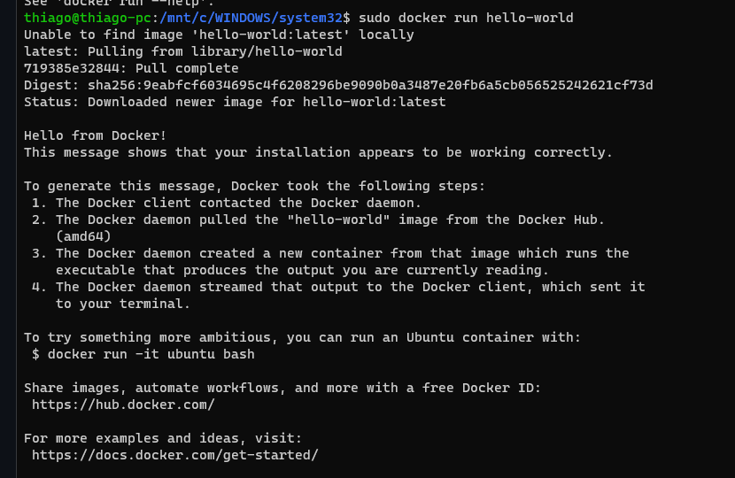
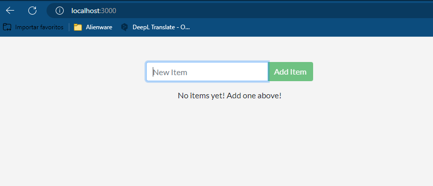

# Documentação do Docker
###  Instalar 

1. Primeiro, atualize os pacotes existentes em seu sistema:

   ```
   sudo apt-get update
   ```

2. Instale as dependências necessárias para o Docker:

   ```
   sudo apt-get install ca-certificates curl gnupg
   ```

3. Adicione a chave GPG oficial do Docker:

   ```
   sudo install -m 0755 -d /etc/apt/keyrings
   ```
   
    ```
    curl -fsSL https://download.docker.com/linux/ubuntu/gpg | sudo gpg --dearmor -o /etc/apt/keyrings/docker.gpg
    ```

    ```
   sudo chmod a+r /etc/apt/keyrings/docker.gpg
   ```
   
4. Defina o repositório Docker:
   
   ```
   echo \
    "deb [arch="$(dpkg --print-architecture)" signed-by=/etc/apt/keyrings/docker.gpg] https://download.docker.com/linux/ubuntu \
    "$(. /etc/os-release && echo "$VERSION_CODENAME")" stable" | \
    sudo tee /etc/apt/sources.list.d/docker.list > /dev/null 
   ```

5. Atualize novamente os pacotes do sistema:

   ```
   sudo apt-get update
   ```

6. Finalmente, instale o Docker:

   ```
   sudo apt-get install docker-ce docker-ce-cli containerd.io docker-buildx-plugin docker-compose-plugin
   ```

7. Verifique se o Docker está funcionando corretamente executando o comando:

   ```
   sudo docker run hello-world
   ```

   Se tudo estiver configurado corretamente, você verá uma mensagem como essa no seu terminal:

    


## Concedendo privilégios ao docker:

Importante conceder privilégios ao docker pois pode ter problemas com as permissões, logo isso evita possiveis problemas e já tira a necessidade de usar `sudo`.

    ```
    sudo groupadd docker
    ```

    ```
    sudo usermod -aG docker $USER
    ```
Se não houve nenhuma mensagem de erro, então funcionou.

    

## Containerizar sua aplicação:
1) Clone um projeto:
   
   ```
   git clone https://github.com/docker/getting-started.git
   ```

2) Entre na pasta app dentro do diretorio

   ```
   cd getting-started/app
   ```
   
4) Crie um arquivo Dockerfile e adicione o código abaixo:

   ```
   FROM node:18-alpine
   WORKDIR /app
   COPY . .
   RUN yarn install --production
   CMD ["node", "src/index.js"]
   EXPOSE 3000
   ```

4) Agora build a imagem com o seguinte comando:
   
   ```
   docker build -t getting-started .
   ```
   
5) E agore execute:

   ```
   docker run -dp 3000:3000 getting-started
   ```
   
Se tudo ocorrer bem ele ira retornar o ID do container  e sua aplicação  estará em execução no seu localhost:3000, assim como na imagem abaixo



## Veresionamento


1) Inicialmente faca login no seu docker hub:

   ```
   docker login
   ```
   
2) Faça suas mudanças na sua aplicação.

Obs: lembre-se de ter criado o repositorio no docker hub.

3) Agora publique sua imagem:

   ```
   docker push tgazaroli/getting-started
   ```

4) E então comite suas mudanças:
   ```
   docker commit <container-id> tgazaroli/getting-started
   ```
   
   
   


